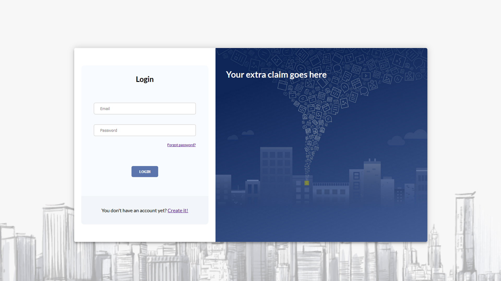

Complete php login system with two step login authentication and control of password expiry.

<b>Classes/config/database.php</b> file, configure your database connection. In main directory you can find Sql file with users and passwords tables

<b>Classes/User.php</b> contains User class with <b>Login($email, $password)</b> method

<b>Controller/login.php</b> is a intermediate file, called by App/js/controller.js by Ajax
